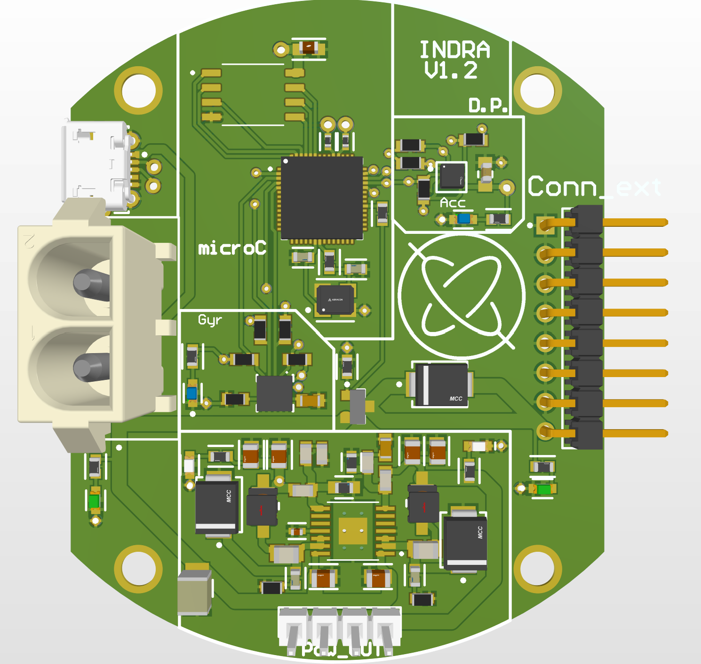

# Indra_exp
Experiment bord for a student rocket. It contains BMA400 and L3GD20H to measure the rotation of the rocket and the direction on the flight.

1 Power Supply IN : 3 accumulators (3S1P), nominal voltage IN : 12,6V
2 power supply OUT : 2 voltages (3V3 & 5V with 3A each).
Buck converter : TPS54283PWPR

µC on the PCB : RP2040
Connection with USB B micro connector. 

  

Activation of a DC motor to control the roll of the rocket is add with a Mosfet and a PWM.
